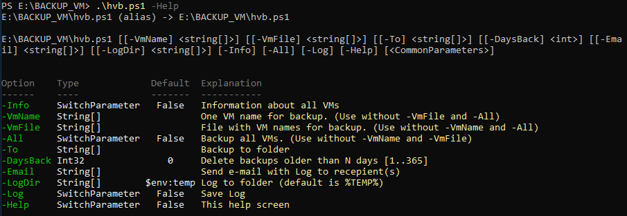
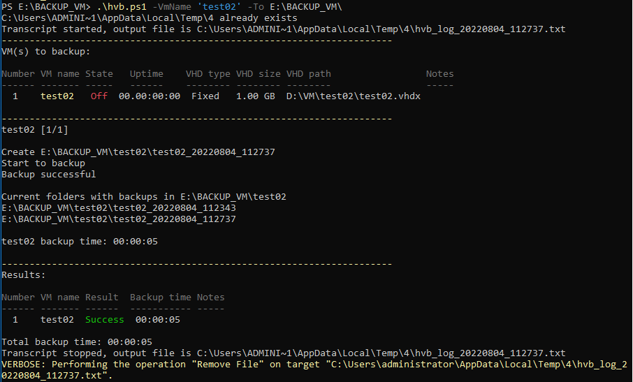

# Hyper-v backup
*Hyper-v backup (export) tool*

### Features

- Hyper-v backup (export):
    - one Vm
    - all Vms
    - VMs from text file
- Delete backups older than *N* days
- E-mail notification
- Show information about all VMs
- Logging

### Tested on

- [Windows Server 2016](https://en.wikipedia.org/wiki/Windows_Server_2016)
- [Powershell](https://docs.microsoft.com/ru-ru/powershell/scripting/install/installing-powershell) 7.2.5

### Recommended
- [Powershell](https://docs.microsoft.com/ru-ru/powershell/scripting/install/installing-powershell) 7.2 for [ANSI escape sequences](https://docs.microsoft.com/en-us/powershell/module/microsoft.powershell.core/about/about_ansi_terminals)
- [xterm](https://en.wikipedia.org/wiki/Xterm)-based terminal

### Preparation

- Change this lines for e-mail notification:

`$EmailFrom = 'example@example.com'`

`$EmailPassword = 'SECRETPASSWORD!'`

`$EmailSmtpServer = 'smtp.example.com'`

`$EmailSmtpPort = 587`

- Uncomment this line to use TLS not SSL for e-mail

`[System.Net.ServicePointManager]::SecurityProtocol = "Tls, TLS11, TLS12"`
- Have enough permissions to work with Hyper-V

### Hyper-v backup command syntax

**hvb.ps1** [**-VmName** *VM_Name*] [**-VmFile** *File_Name*] [**-To** *Backup_folder*] [**-DaysBack** *Count*] [**-Email** *e-mail_Recipient*] [**-LogDir** *Log_Folder*] [**-Info**] [**-All**] [**-Log**] [**-Help**]

|Options|Explanation|Default value|
|---|---|:---:|
|**-VmName** *VM_Name*|Name of VM to backup||
|**-VmFile** *File_Name*|File with names of VMs to backup||
|**-All**|Backup all VMs||
|**-To** *Backup_folder*|Folder for backup||
|**-DaysBack** *count*|Delete backups older than *N* days||
|**-Email** *e-mail_Recipient*|E-mail recipient to send log||
|**-LogDir** *Log_Folder*|Folder for log|%Temp%|
|**-Info**|Show information about all VMs|False|
|**-Log**|Save log file|False|
|**-Help**|Help screen. *No options at all to have the same.*|False|

### Examples

`PS> .\hvb.ps1 -VmName vm_debian -To C:\Backup -LogDir C:\Logs -Log -DaysBack 5 -Email example@example.com`

or simple

`PS> .\hvb.ps1 -VmName vm_debian -To C:\Backup`

